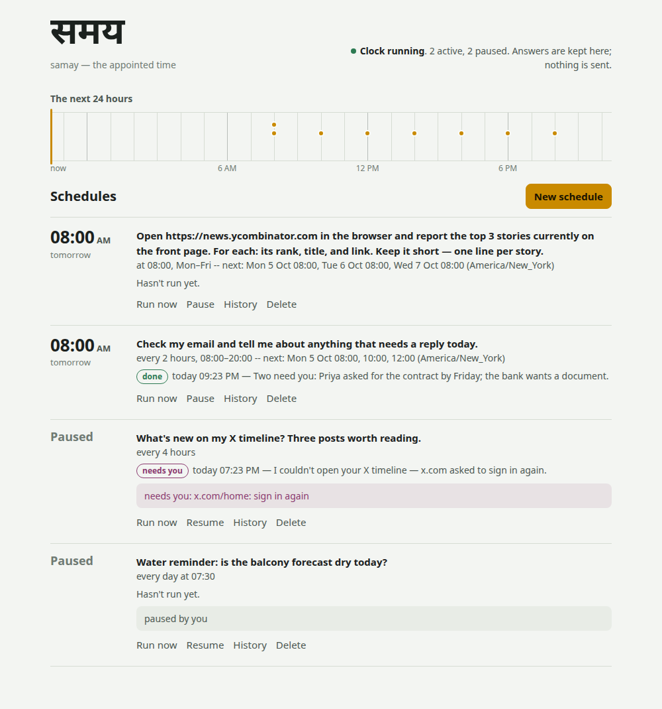

# samay — the clock that asks your agent to do something later

"Check my email every two hours and tell me if anything needs me."
"Every weekday at 8, see what's new on my X timeline."

An agent can do either of those once, while you watch. **Samay** is
what makes it happen on a schedule, while you don't. It keeps a list
of schedules, wakes up when one is due, asks [Yantra](https://github.com/kunwarmahen/yantra)
to do the work, writes down what came back, and leaves you a record
you can read, pause, or delete.

## The name

**samay** — समय (Sanskrit *samaya*; said roughly *suh-my*).

In Hindi, *samay* simply means **time**: *kya samay hua hai?* is
"what time is it?". The Sanskrit *samaya* it comes from means more than that: *a
coming together*, *an agreement*, and **the appointed time**, the
moment two parties settled on. That's this program's whole job. You
and your agent agree on something ("every weekday at 8, check X"),
and Samay keeps the appointment.

```
            ┌─────────────────────────────┐
  samay add │  schedules      runs        │  samay list / runs / show
  ─────────▶│  (what to do,   (what       │◀─────────────────────────
            │   and when)      happened)  │
            └──────┬──────────────▲───────┘
                   │ due          │ answer, cost, what it needed
                   ▼              │
            yantra --json --unattended --prompt "..."
                   │
                   └─▶ the browser, your mail, your skills ...
```

**Samay never does the work itself.** It's a clock and a logbook.
Opening a browser, reading mail, running a skill: that's always a
Yantra turn, the same one you'd get by typing the prompt yourself.
Samay starts Yantra as a program and reads the one JSON object it
prints. It imports nothing from Yantra and has no dependencies of its
own.

How it's built, and why, is in the notes:
[01 — a clock and a logbook](notes/01-a-clock-and-a-logbook.md);
[02 — as the person](notes/02-as-the-person.md), the Dvara road, and
how an answer reaches somebody who wasn't asked;
[03 — offered, then accepted](notes/03-offered-then-accepted.md), the
page, and the tools an agent uses to suggest a schedule;
[04 — new against what was told](notes/04-new-against-what-was-told.md),
what a `when_new` run is shown so it can tell what's new;
[05 — a lock, not a pid](notes/05-a-lock-not-a-pid.md), how "is the
clock running?" stays right after a crash and from another container.

## Works with

* **[Yantra](https://github.com/kunwarmahen/yantra)** does every run: Samay starts `yantra --json
  --unattended` (the direct road). Yantra also finds Samay by itself, so
  the agent can offer a schedule, with a card in words and a Schedules
  panel in `yantra --web` (Yantra's notes 115 and 116).
* **[dvara](https://github.com/kunwarmahen/dvara)** is the other road: a run as a person, on their
  allowance, answered on their Telegram (see *Two roads* below). With
  `dvara --samay`, a person's agent can offer a schedule in the chat
  (dvara's [tutorial §15](https://github.com/kunwarmahen/dvara/blob/main/TUTORIAL.md)).
* **[Setu](https://github.com/kunwarmahen/setu)** is reached through Yantra: a direct-road run is an
  ordinary Yantra run, so it can read the accounts Setu keeps without
  asking. On the Dvara road a run reaches the person's own accounts,
  when dvara gives them a Setu folder ([dvara's note 19](https://github.com/kunwarmahen/dvara/blob/main/notes/19-their-own-accounts.md)).

## Setup

```bash
uv sync
# Tell Samay how to start Yantra, and where (Yantra reads .env from there):
export SAMAY_YANTRA=~/yantra/.venv/bin/yantra
export SAMAY_YANTRA_HOME=~/yantra
```

Local models and cloud ones are both fine. Samay doesn't choose: the
Yantra it starts uses whatever its `.env` says. To run schedules on
your own Ollama box, put `YANTRA_PROVIDER=ollama` and
`OLLAMA_MODEL=qwen3.8:latest` in Yantra's `.env`, or in Samay's
environment, which the runs inherit.

## Using it

```bash
# what a 'when' means, before anything is saved
samay preview "at 08:00 on weekdays"
#   at 08:00, Mon–Fri -- next: Mon 5 Oct 08:00, Tue 6 Oct 08:00, Wed 7 Oct 08:00 (America/New_York)

# a plain question every two hours, told to you only when there is news
samay add "Any mail that needs me today? Say who and why." --when "every 2h"

# a browser check: the browser tools are allowed ahead of time
samay add "Open https://news.ycombinator.com and tell me the top 3 stories." \
      --when "at 08:00 on weekdays" --allow-tools 'browser_*' --notify always

# run the clock, and its page (keep it running: nothing runs on time otherwise)
samay serve
#   page: http://127.0.0.1:8780/#token=…     open this once; the browser keeps it

# see, check, stop, take back
samay list
samay runs                 # newest first, every schedule
samay show 67cad6f8        # one schedule in full (an id's first few letters do too)
samay run-now 67cad6f8     # once, now, here -- and wait for it
samay pause 67cad6f8
samay resume 67cad6f8      # its next time is worked out from now
samay rm 67cad6f8          # the schedule and its history
```

`samay list` looks like this:

```
67cad6f8  active  at 08:00, Mon–Fri -- next: Mon 5 Oct 08:00, Tue 6 Oct 08:00, Wed 7 Oct 08:00 (America/New_York)
          Open https://news.ycombinator.com with the browser and tell me the titles of the top 3…
          last: ok  Sun 4 Oct 20:42  'Here are the top 3 stories on Hacker News right now: 1. Run…'
```

Every command takes `--json`, for a page or a program to read.

### Keeping it running

`samay serve` in a terminal stops when the terminal closes or the
machine restarts, and nothing tells you until the 08:00 check doesn't
come. On Linux, let systemd keep it running instead:

```bash
# in the shell where SAMAY_YANTRA, SAMAY_DVARA_URL etc. are already set
samay unit --install
#   wrote ~/.config/systemd/user/samay.service
#   wrote ~/.config/samay/samay.env (yours alone): PATH, SAMAY_STATE, SAMAY_YANTRA
#   nothing is started; to start it now and at every login:
systemctl --user daemon-reload
systemctl --user enable --now samay
journalctl --user -u samay -f            # what it says, including the page's address
loginctl enable-linger $USER             # optional: keep it running when you log out
```

A service starts with almost nothing set, so `--install` copies this
shell's `SAMAY_*` and `YANTRA_*` settings, and its `PATH`, into
`samay.env`. That file can hold tokens, so only you can read it; the
unit itself holds no setting. Change a setting by running `--install`
again from a shell that has it, then `systemctl --user restart samay`.
`samay unit` without `--install` only prints the unit. Nothing is
started for you: whether a program keeps running while you're logged
out is your decision. The page's address, token included, goes to your
own journal, the same as it would to your terminal.

### The page

`samay serve` also serves a page, at the address it prints. It shows
the next 24 hours as a strip with a dot for every run due, then every
schedule: when it next runs, what it does, how its last run went, and
why it's paused if it is. Each one has **Run now**, **Pause** or
**Resume**, **History** (every run, with the full answer behind a
click), and **Delete**. **New schedule** says your *when* back in words
as you type it, before anything is saved.



It listens on localhost only (`--host` to change that, `--port` for
another port, `--port 0` for no page), and every request behind it
needs a token. Any website you visit could send a request to
127.0.0.1, so localhost alone isn't protection. The token is made once
and kept in the state folder, readable by you alone (or set
`SAMAY_TOKEN`). It reaches the page after the `#` in the printed
address, which a browser never sends to a server, so it doesn't end
up in any log.

The page is drawn from a small JSON API, which any program may use:

```
GET    /api/status                      is the clock running; how many schedules
GET    /api/schedules                   every schedule, its last run, the next day's times
POST   /api/preview      {when, tz}     the sentence, before anything is saved
POST   /api/schedules    {prompt, when, notify, allow_tools, runner, agent, as, time_limit}
POST   /api/schedules/ID/pause | /resume | /run      (run answers 202 at once)
DELETE /api/schedules/ID
GET    /api/runs?schedule=ID&limit=N
```

### Your agent can offer it

The best moment to set something up is in the middle of a
conversation: "keep an eye on this for me". `samay mcp` is an MCP
server with the tools an agent uses to offer that:

```bash
samay mcp --for local --agent ~/agents/reader    # what a harness starts
```

| Tool | |
|---|---|
| `preview_schedule` | checks a *when* and says it back in words, with the next three times |
| `list_schedules`, `schedule_runs` | what this person has set up, and how it went |
| `create_schedule` | saves one; the prompt is written for the agent's future self |
| `pause_schedule`, `resume_schedule`, `delete_schedule` | |

**The agent proposes and you accept.** The three reading tools are
marked read-only and the four that change something aren't, so a
harness that honours the mark (Yantra does) asks you before every
create, pause, resume and delete. In the browser that's a card, at the
terminal a y/N, on Telegram two buttons. The tools tell the model to
preview first and tell you the sentence, so by the time the card
arrives you've read what it means.

**One person per server.** `--for` is fixed by the harness. The model
has no way to name anyone else, and someone else's schedule is "no
schedule" to every tool. `--agent` and `--runner` are the harness's to
set too: a schedule made while talking to your mail agent runs your
mail agent. There's no run-now tool, because a run is itself an agent
turn, minutes long, and starting one from inside another would hold it
up.

`samay status --json` tells a harness whether Samay is here, whether
its clock is running, and how to start `samay mcp`.

**In Yantra, there's nothing to set up.** When `samay` is on `PATH` (or
`YANTRA_SAMAY` names it), Yantra reads `samay status --json` at startup,
starts `samay mcp --for local` itself, and writes the approval card for
a new schedule in words: when, who hears, what each `allow_tools` glob
reaches in that agent, and which of your accounts the run could change
or read. `yantra --web` gets a Schedules panel that uses the `--json`
commands below, so it works whether or not `samay serve` is running
(Yantra's notes/115).

### Saying when

`--when` takes a short form, or the same thing as JSON, which is what an
agent sends:

| Short form | JSON |
|---|---|
| `every 3h` | `{"every": "3h"}` |
| `every 30m between 09:00-18:00 on mon-fri` | `{"every": "30m", "between": "09:00-18:00", "days": "mon-fri"}` |
| `at 08:00` (or `daily at 8am`) | `{"at": "08:00"}` |
| `at 08:00,20:00 on weekdays` | `{"at": ["08:00", "20:00"], "days": "weekdays"}` |
| `once 2026-10-06T15:00` | `{"once": "2026-10-06T15:00"}` |
| `cron 0 */2 * * *` | `{"cron": "0 */2 * * *"}` |

Times are in your time zone (`--tz`, `$SAMAY_TZ`, or this machine's),
and "08:00" stays 08:00 when the clocks change. Nothing runs more often
than every five minutes, however it's written. A mistake is refused
before anything is saved, with what to write instead:

```
$ samay add "x" --when '{"evry": "3h"}'
error: unknown key(s) evry in "when"; known: every, at, once, cron, between, days
```

### What gets sent to you

`--notify` decides, per schedule:

* `when_new` (default): the agent is asked to reply `NOTHING NEW` when
  it did the check and found nothing worth telling. Those runs are
  kept and not sent. To judge what's new, each run is shown what the
  last one that said something reported (up to 1,500 characters), and
  `NOTHING NEW` counts as the reply's first line or as its verdict on
  the last ([note 04](notes/04-new-against-what-was-told.md)).
* `always`: every answer is sent.
* `never`: everything is kept, nothing is sent.

If a schedule is paused (see below), you're always told, whatever
`--notify` says.

> **Where is "sent"?** Sending needs a channel, and the channels live
> in Dvara, the always-on service Yantra agents live behind. With
> `SAMAY_DVARA_URL` set, answers go to the person's own channels
> (Telegram) through Dvara, whichever road the run took. Without it,
> runs are kept for `samay runs` and nothing more.

### When something goes wrong

| What happened | Recorded as | What Samay does |
|---|---|---|
| Dvara asked you to approve a tool, and you haven't answered yet | `held` | nothing more: you were asked on your channel; answer there and the turn carries on |
| The machine was off at the time | `missed` | runs it late if still within its grace (half its step, at most an hour), otherwise moves on. **Never replays a backlog.** |
| The last run was still going | `skipped` | waits for the next time |
| The browser profile was in use by another Yantra | `busy` | nothing; the next time tries again |
| A site needs you to sign in again, or the agent had a question | `needs_person` | **pauses the schedule** and tells you what's needed |
| It failed 3 times in a row | `failed` | **pauses the schedule** and tells you |
| It ran past its time limit (default 10 minutes) | `timed_out` | stops it, browser and all |
| Samay stopped while it ran | `interrupted` | doesn't run it again |

Tools a run reached for and wasn't allowed are listed under the run
(`not allowed: web_fetch, bash`). They don't stop anything. They're
there so you can decide whether to allow them next time.

### Browser schedules

Logins live in a browser profile, and only one browser can use a
profile at a time. If your `yantra --web` keeps its browser open all
day, a scheduled browser run on the same profile will keep coming back
`busy`. Give the schedule a profile of its own and sign in there once:

```bash
YANTRA_BROWSER_PROFILE=~/samay-browser yantra --browse-login https://x.com
samay add "What's new on my X timeline?" --when "every 4h" \
      --allow-tools 'browser_*' --browser-profile ~/samay-browser
```

Your [Setu](https://github.com/kunwarmahen/setu) connections are there
for a scheduled run too, exactly as for any Yantra run. Their read-only
tools run without being named in `--allow-tools`.

## Two roads

Every schedule runs one of two ways. Both run the same Yantra; they
differ in *who* the run is, and where its answer can go.

| | `--runner direct` (default) | `--runner dvara` |
|---|---|---|
| Who does the work | Yantra, started here as a program | Yantra, inside Dvara, **as a person** on Dvara's actors file |
| `--agent` | a package folder (or none) | an agent's name on Dvara's roster |
| What may run unasked | read-only tools, plus `--allow-tools` | the same, but only what that person could have been asked about: the owner's deny rules still refuse, and a read-only person is never answered for |
| A tool nobody allowed | refused, listed under the run | **put to the person** on Telegram; if they don't answer in time, the run is `held` until they do |
| Who pays | nobody counts it | the person's **daily allowance** |
| Where the answer goes | Dvara, if set up (see below); otherwise only `samay runs` | the person's channels |

The Dvara road:

```bash
# Dvara running with its HTTP surface (and, for Telegram, a bot in the same process):
DVARA_TOKEN=... dvara --ask --on-timeout hold serve --telegram scribe

export SAMAY_DVARA_URL=http://127.0.0.1:8765
export SAMAY_DVARA_TOKEN=...          # Dvara's DVARA_TOKEN
samay add "Any mail that needs me today?" --when "every 2h" \
      --runner dvara --agent scribe --as mahen
```

`--as` names the person on Dvara's actors file; `SAMAY_DVARA_ACTOR` is
the default for both roads, so direct-road answers reach that person
too. A schedule is checked against Dvara when it is made: an agent
Dvara doesn't offer, or nobody to run as, is refused before anything
is saved.

## Settings

| Variable | What |
|---|---|
| `SAMAY_STATE` | where schedules and runs are kept (default `~/.samay`; also `--state`) |
| `SAMAY_YANTRA` | the command that starts Yantra; may be several words (`uv run --project ~/yantra yantra`) |
| `SAMAY_YANTRA_HOME` | the folder Yantra starts in, for its `.env` |
| `SAMAY_TZ` | the default time zone for new schedules |
| `SAMAY_DVARA_URL` | where Dvara's HTTP surface is; set, answers are sent and `--runner dvara` works |
| `SAMAY_DVARA_TOKEN` | Dvara's `DVARA_TOKEN` |
| `SAMAY_DVARA_ACTOR` | the person a schedule made here runs as and is sent to, when `--as` isn't given |
| `SAMAY_MAX_SCHEDULES` | how many schedules one person may have (default 20) |
| `SAMAY_TOKEN` | the page's token, instead of the one Samay makes and keeps in the state folder |
| `SAMAY_PUBLIC_URL` | where a browser reaches the page when that isn't where `samay serve` is bound -- a container's port mapping, a proxy (also `--public-url`). Bound to `0.0.0.0` without it, the page reports `127.0.0.1` |

Everything is in one SQLite file, `~/.samay/samay.sqlite3`, readable
with the `sqlite3` shell. Each schedule's runs work in a folder of
their own, `~/.samay/work/<id>`. The agent's tools can't write outside it.

## The source

```
src/samay/
├── when.py       the 'when' form: checked, said back in words, the next times,
│                 a five-minute floor, time zones that survive a clock change
├── store.py      the SQLite file: schedules (the promise) and runs (the receipt)
├── schedules.py  add / pause / resume / remove, the per-person cap, preview
├── clock.py      the rules: missed, skipped, claimed before running, paused
│                 after failures or a need, what is sent (a when_new run is
│                 shown the last report, note 04); samay serve's loop
├── runners.py    the direct road: yantra as a program, killed with its whole
│                 process group at the time limit, only its JSON believed
├── dvara.py      the Dvara road: POST /message as the person, unattended, with
│                 what they allowed ahead of time; answers out through
│                 POST /notify. Standard library only
├── http.py       the page and its JSON API, beside the clock in samay serve:
│                 a token on every call, localhost by default
├── static/       the page: one file, no fonts or scripts fetched from anywhere
├── mcp.py        the agent's tools, for one person (stdio MCP, by hand)
├── status.py     samay status --json: is it here, is the clock running (a
│                 lock it holds, notes/05),
│                 how to start the tools
├── unit.py       samay unit: a systemd user unit for samay serve, and an env
│                 file (yours alone) with the settings a service would lack
└── cli.py        the commands above
```

## Status

The clock, the records, the rules above, both roads, the page and the
agent's tools all work, and are covered by 157 tests. The API is not
stable.

Not here yet:
* ~~Yantra finding Samay by itself, with a Schedules tab in `yantra
  --web`.~~ Done on Yantra's side (its notes/115).
* ~~The Dvara road for agent-made schedules.~~ `dvara --samay` starts
  `samay mcp --for <their id> --runner dvara` for each person's turn
  (Dvara's note 18).

## Tests

```bash
uv run pytest -q          # offline: a fake clock, a fake runner, a fake yantra,
                          #   a fake Dvara and the page's own server on local
                          #   sockets, and samay mcp as a real process
```
